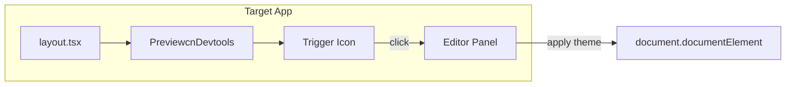

# Embedded Devtools Mode Implementation

## Goal

ターゲットアプリ内に DevTools 風のテーマエディターを埋め込み、iframe/2サーバー構成の摩擦を解消する。

- 画面端に小さなアイコン（DevTools風）
- クリックでオーバーレイ/パネルを開く
- iframeなし、CSP問題なし、単一devサーバー
- production-safe（dev-onlyガード）

## Key Decisions

| 決定事項 | 選択 ||---------|------|| 配布方式 | **npmパッケージ**（`@previewcn/devtools`）、ビルド済みCSS同梱 || ターゲット側編集 | `layout.tsx` のみ（globals.css / tailwind設定は**いじらない**） || 既存iframeモード | **残す**（devtoolsは追加オプション） || init連携 | `npx previewcn init --devtools` でインストール+セットアップ |

## Architecture




## Implementation

### 1) Create `packages/devtools/` package

```javascript
packages/devtools/
├── src/
│   ├── index.ts              # Export PreviewcnDevtools
│   ├── devtools.tsx          # Main component (lazy-loads panel)
│   ├── trigger.tsx           # Corner icon button
│   ├── panel/
│   │   ├── index.tsx         # Editor panel (color, font, radius, mode)
│   │   ├── color-picker.tsx
│   │   ├── font-selector.tsx
│   │   ├── radius-slider.tsx
│   │   └── mode-toggle.tsx
│   ├── theme-applier.ts      # Apply theme to DOM (no postMessage)
│   └── styles.css            # Tailwind source (built at package build time)
├── package.json
├── tsconfig.json
├── tsup.config.ts
└── postcss.config.js         # For building CSS
```

**Key points:**

- `tsup` + `postcss` でビルド時にTailwindを処理 → `dist/styles.css` を生成
- CSS変数（`var(--primary)` 等）を使用してshadcnテーマと連携
- `PreviewcnDevtools` は `NODE_ENV === "development"` ガード付き

### 2) Devtools component structure

```tsx
// packages/devtools/src/devtools.tsx
"use client";

import { lazy, Suspense, useState } from "react";
import { Trigger } from "./trigger";

const Panel = lazy(() => import("./panel"));

export function PreviewcnDevtools() {
  // Production guard
  if (process.env.NODE_ENV !== "development") {
    return null;
  }

  const [open, setOpen] = useState(false);

  return (
    <>
      <Trigger onClick={() => setOpen(true)} />
      {open && (
        <Suspense fallback={null}>
          <Panel onClose={() => setOpen(false)} />
        </Suspense>
      )}
    </>
  );
}
```


### 3) Update CLI `init` command

[`packages/cli/src/commands/init.ts`](packages/cli/src/commands/init.ts) に `--devtools` オプションを追加:

- `--devtools` フラグが指定された場合:

1. `@previewcn/devtools` を devDependency としてインストール
2. `layout.tsx` に import 2行 + コンポーネント1行を追加
```tsx
// Added to layout.tsx by init --devtools
import "@previewcn/devtools/styles.css";
import { PreviewcnDevtools } from "@previewcn/devtools";

// Inside body:
{process.env.NODE_ENV === "development" && <PreviewcnDevtools />}
```


### 4) Theme application (no postMessage)

現在のreceiver方式（postMessage）ではなく、**直接DOMに適用**:

```ts
// packages/devtools/src/theme-applier.ts
export function applyTheme(config: ThemeConfig) {
  const root = document.documentElement;
  
  // Apply CSS variables
  Object.entries(config.cssVars).forEach(([key, value]) => {
    root.style.setProperty(`--${key}`, value);
  });
  
  // Apply dark mode
  if (config.darkMode !== undefined) {
    root.classList.toggle("dark", config.darkMode);
  }
}
```


### 5) Build pipeline

- `packages/devtools/package.json`:
- `exports`: `./styles.css` と `.` (component) を分けてexport
- `build`: `tsup` (TSX) + `postcss` (CSS)
- Turborepo: `packages/devtools` を追加

## Files to Create/Modify

| File | Action ||------|--------|| `packages/devtools/` | **Create** - 新規パッケージ || `packages/cli/src/commands/init.ts` | **Modify** - `--devtools` オプション追加 || `packages/cli/src/utils/modify-layout.ts` | **Modify** - devtools追加ロジック || `pnpm-workspace.yaml` | Already includes `packages/*` || `turbo.json` | **Modify** - devtools build追加 |

## Migration Path

1. **Phase 1**: `@previewcn/devtools` パッケージ作成、基本UI実装